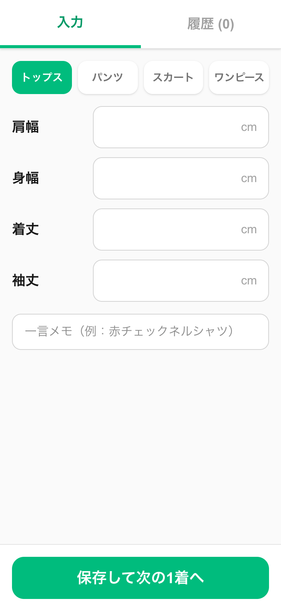
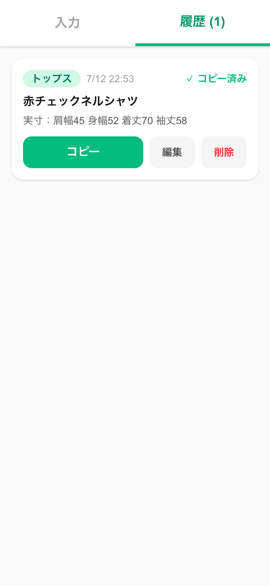

# 採寸表ジェネレーター

メルカリ古着出品の採寸メモをスマホで入力し、出品文にそのまま貼れる実寸1行テキスト
「実寸：肩幅45 身幅52 着丈70 袖丈58」をワンタップでコピーできるアプリ。

**公開URL**: https://saisun-app.vercel.app

## スクリーンショット

| 入力画面 | 履歴画面 |
|---|---|
|  |  |

## 誰の・何を・どう解決するか

- **誰の**: 古着せどらー（作者＋古着仲間）
- **何を**: 週末の30着まとめ撮影で、採寸値を紙にメモ→後日出品文へ手打ち転記する二度手間と転記ミス
- **どう**: 採寸しながらスマホ入力→端末に自動保存→出品時に1行テキストをワンタップコピー
- **2台で使う**: 家族コード1本で、別の端末で採寸した分も両方向で共有される（ログイン不要）

## 主な機能

- 衣類4種（トップス/パンツ/スカート/ワンピース）で入力項目が切り替わる
- 数字キーパッド自動表示・2桁入力で次の欄へ自動フォーカス（測る順に配置）
- 着丈・総丈・ウエストは100cm超も入力可（3桁目を待ってから移動）
- 一言メモ付き履歴。編集・削除・コピー済みマーク対応
- **端末間共有**：家族コード（英数字12桁）を共有リンクで渡すだけ。アカウント登録・パスワードなし
- **電波が無くても入力できる**：保存は端末内。通信できるタイミングでまとめて同期する
- ホーム画面に追加して使うPWA。JSONでのバックアップ書き出し付き

## 技術スタック

- Next.js 16 (App Router) / TypeScript / Tailwind CSS 4
- データ保存: localStorage（正）＋ Supabase / Postgres（端末間同期）
- ホスティング: Vercel

## 2台目をつなぐ

1. すでに使っている端末の **設定** タブ →「共有リンクを送る」
2. もう一方の端末でそのリンクを開く（自動でつながる）
3. どちらの端末も **ホーム画面に追加** して、以降はそこから開く

> ⚠️ ホーム画面アプリはSafariのタブとは**別の保存領域**を持ちます。
> 追加した直後は履歴が空に見えるので、設定タブで家族コードを入れて同期してください。
> （Safariのタブのままだと、7日開かないだけでデータが消えることがあります）

## 開発

```bash
npm install
npm run dev
```

`.env.local` に以下が必要（Vercel側にも同じ2つを設定する）。

```
SUPABASE_URL=https://xxxxxxxx.supabase.co
SUPABASE_SECRET_KEY=sb_secret_xxxxxxxx
```

`SUPABASE_SECRET_KEY` はサーバー側だけで使う。**ブラウザへ出さないこと**
（`entries` テーブルはRLS有効・ポリシー0件なので、公開キーでは読み書きできない）。

要件定義は [requirements.md](requirements.md) を参照。
